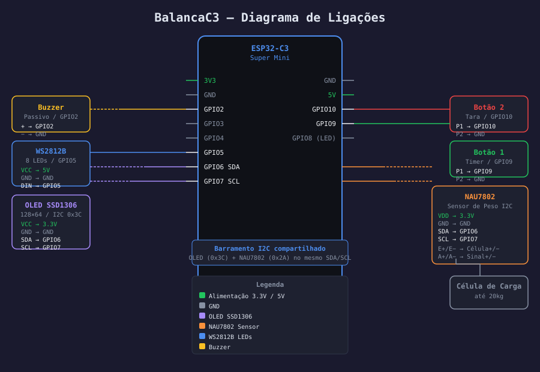

# BalancaC3

Uma balança de precisão para café, construída em torno do microcontrolador ESP32-C3, pensada para quem leva a sério cada detalhe da extração.

---

## O que é

BalancaC3 é um dispositivo embarcado que combina balança de precisão, timer e conectividade WiFi em um equipamento compacto. Ele foi projetado para acompanhar o processo de preparo do café — seja pour over, espresso, aeropress ou qualquer outro método que dependa de controle de peso e tempo.

---

## O que ele faz

### Pesagem
- Mede o peso em tempo real com resolução de 0,1g
- Display OLED mostra o valor de forma clara e legível
- Atualização rápida para acompanhar o café sendo despejado
- Tara com um toque no botão — zera a medição instantaneamente

### Timer
- Timer integrado no mesmo display do peso
- Inicia e pausa com um clique no botão
- Reseta com um clique longo
- Formato M:SS — fácil de ler de longe

### Receitas
- Crie receitas com múltiplos passos (despejo, aguardar, bloom)
- Cada passo tem duração, volume de água e nome personalizáveis
- Siga a receita pelo dispositivo: timer e barra de LED guiam cada etapa
- Buzzer avisa ao final de cada passo e ao término da receita

### Indicadores visuais
- Fita de 8 LEDs coloridos que indicam o estado do dispositivo:
  - **Branco** ao ligar
  - **Verde piscando** enquanto conecta ao WiFi
  - **Verde fixo** ao conectar, apagando suavemente
  - **Amarelo respirando** quando está no modo de configuração
  - **Azul em barra** mostrando progresso de atualizações ou etapa da receita
  - **Vermelho** em caso de erro
- Feedback visual imediato ao pressionar os botões

### Conectividade WiFi
- Conecta à sua rede doméstica
- Se não houver configuração, cria uma rede própria para setup
- Acessível pelo navegador de qualquer dispositivo na mesma rede

### Interface web
- Acesse pelo IP do dispositivo no browser
- Veja o peso e o timer em tempo real, com o mesmo ícone ▶/⏸ do display
- Tare diretamente pela interface
- Controle os dois botões pela tela — toque rápido ou segurar, exatamente como nos botões físicos
- Os botões da tela piscam quando os botões físicos são pressionados
- Gerencie receitas (criar, editar, excluir)
- Sem necessidade de aplicativo

### Configuração pelo browser
- Selecione e configure a rede WiFi sem precisar de cabo
- Reconfigure ou apague as credenciais quando quiser
- Ajuste o brilho dos LEDs com preview ao vivo
- Calibre a balança informando um peso conhecido
- Atualize o firmware remotamente (OTA) sem tirar o dispositivo do lugar

---

## Manual de uso

### Iniciando o dispositivo

Ao ligar, o display exibe o logo da BalancaC3 e um jingle toca confirmando que o sistema está pronto. Em seguida:

- Se houver WiFi configurado: o display mostra **"Conectando..."** e ao conectar exibe o IP da rede por alguns segundos antes de ir para a tela principal.
- Se não houver WiFi configurado (ou a rede não for encontrada): o display exibe **"Modo configuração"** e o dispositivo cria a rede `BalancaC3-Config`. Conecte-se a ela e acesse `192.168.4.1` para configurar o WiFi.

---

### Tela principal

A tela normal de operação exibe dois elementos:

```
     ⏸ 0:00          ← timer (ícone + tempo)
  ─────────────────
      250.3 g         ← peso atual
```

O ícone ao lado do timer muda conforme o estado:
- **▶** — timer em contagem
- **⏸** — timer parado ou zerado

---

### Botões

| | Botão 1 (GPIO 3) | Botão 2 (GPIO 1) |
|---|---|---|
| **Toque rápido** | Inicia / pausa o timer | Tara (zera o peso) |
| **Toque longo** | Zera o timer | Abre o menu de receitas |

> **Toque rápido:** pressionar e soltar em menos de ~700ms.
> **Toque longo:** manter pressionado por ~700ms ou mais.

---

### Timer

O timer funciona de forma independente do peso:

1. **Iniciar:** toque rápido no Botão 1 — o ícone muda para ▶ e a contagem começa.
2. **Pausar:** toque rápido no Botão 1 novamente — o ícone muda para ⏸ e o tempo congela.
3. **Retomar:** toque rápido no Botão 1 — contagem continua de onde parou.
4. **Zerar:** toque longo no Botão 1 — volta para 0:00 e pausa.

---

### Exemplo: café V60 sem receita

Este exemplo mostra como usar a BalancaC3 manualmente para preparar um V60 (15g de café, 250ml de água):

**Preparo:**

1. Coloque o suporte V60 com filtro e copo na balança.
2. **Toque rápido no Botão 2** para tarar (zerar o peso com o equipamento).
3. Adicione 15g de café moído — o display deve mostrar `15.0 g`.
4. **Toque rápido no Botão 2** para tarar novamente (agora o café não conta).

**Extração:**

5. Inicie o preparo: assim que começar a verter a água, **toque rápido no Botão 1** para iniciar o timer.
6. **Bloom** (1ª fase): adicione ~40ml de água em movimentos circulares. Acompanhe o peso no display.
7. Aguarde ~45 segundos observando o timer.
8. **1ª vertida:** adicione água até ~100g. Aguarde ~30 segundos.
9. **2ª vertida:** continue até ~175g. Aguarde ~30 segundos.
10. **3ª vertida:** complete até 250g e aguarde a drenagem total.
11. Ao terminar, **toque rápido no Botão 1** para pausar o timer e registrar o tempo total.

> Use o **Botão 2** a qualquer momento para tarar e medir incrementos de água em cada fase.

---

### Receitas

As receitas permitem programar o preparo com passos automáticos, contagem regressiva por etapa e alertas sonoros. Elas são criadas pelo browser e seguidas pelo dispositivo.

#### Criando uma receita (browser)

1. Conecte-se à mesma rede que a BalancaC3 e acesse o IP exibido no display.
2. Vá na aba **Receitas** e clique em **Nova receita**.
3. Dê um nome (ex: `V60 250ml`) e adicione os passos:
   - **Tipo:** nome do passo (ex: `Bloom`, `Despejo`, `Aguardar`)
   - **Água (ml):** volume alvo para este passo (0 para passos de espera pura)
   - **Duração (s):** tempo de contagem regressiva após o passo iniciar
4. Salve a receita.

#### Seguindo uma receita no dispositivo

**Passo 1 — Abrir o menu:**

1. Na tela principal, faça um **toque longo no Botão 2**.
2. O display exibe a lista de receitas salvas mais a opção **Sem Receita**.

```
   RECEITAS
 ─────────────────
   V60 250ml
 > Espresso 40ml     ← selecionado
   Aeropress
 ─────────────────
 [1] navegar  [2L] selec.
```

**Passo 2 — Navegar e selecionar:**

3. **Toque rápido no Botão 1** para mover a seleção para o próximo item.
4. Ao chegar na receita desejada, **toque longo no Botão 2** para selecionar.
5. O display exibe `*` e `ok?` ao lado do item, pedindo confirmação:

```
 * V60 250ml    ok?
```

**Passo 3 — Confirmar ou cancelar:**

6. **Toque rápido no Botão 1** → cancela a seleção e volta à navegação.
7. **Qualquer toque ou toque longo no Botão 2** → confirma e inicia a receita.

**Passo 4 — Executar a receita:**

8. O display muda para a tela de receita ativa:

```
 Bloom  (1/4)
 ─────────────────
 -  0:00       v 0:45
 ─────────────────
 Alvo: 40ml → 40ml
        0.0 g
```

9. A barra de LED fica **azul escuro** — aguardando o início do passo.
10. **Adicione água** até o peso mudar mais de 1,5g — o timer do passo inicia automaticamente.
11. A barra de LED começa a **drenar em azul claro** mostrando o tempo restante do passo.
12. Ao final do passo, o buzzer emite **3 bipes curtos** de aviso com 1 segundo de antecedência, e o próximo passo começa automaticamente.

> Passos do tipo **Aguardar** iniciam a contagem imediatamente, sem precisar detectar peso.

**Passo 5 — Conclusão:**

13. Ao concluir todos os passos, o display exibe uma animação de café fumegante e o buzzer toca **3 bipes descendentes**. Após 4 segundos, a tela retorna ao peso normal.

**Cancelar durante a receita:**

- **Toque longo no Botão 2** durante a execução → abre o menu novamente, onde é possível selecionar **Sem Receita** para sair.

---

#### Exemplo: V60 250ml como receita programada

| Passo | Tipo | Água (ml) | Duração |
|-------|------|-----------|---------|
| 1 | Bloom | 40 | 45s |
| 2 | Despejo 1 | 100 | 30s |
| 3 | Despejo 2 | 175 | 30s |
| 4 | Despejo Final | 250 | 60s |

Com essa receita salva, o fluxo completo fica:

1. Tare a balança com o copo vazio.
2. Abra o menu (toque longo B2), selecione **V60 250ml** e confirme.
3. Comece a verter — o timer inicia ao detectar o primeiro grama de água.
4. A cada fase: adicione a quantidade indicada no display, aguarde o bipe e passe para a próxima.
5. Ao final: animação + bipes indicam que o café está pronto.

---

## Calibração

A balança precisa ser calibrada uma única vez com um peso conhecido (por exemplo, 1kg). Após isso, os dados ficam salvos e o dispositivo lembra a calibração mesmo após desligar. A calibração pode ser refeita a qualquer momento pela interface web em **Balança > Calibrar**.

---

## Ligações



### ESP32-C3 Super Mini — mapa de pinos

```
                    ┌─────────────────┐
                    │  ESP32-C3 Super │
                    │      Mini       │
              3.3V ─┤ 3V3         GND ├─ GND
               GND ─┤ GND          5V ├─ 5V
     [Buzzer +] ───┤ GPIO2       GPIO1├─── [Botão 2] ── GND
     [Botão 1] ────┤ GPIO3       GPIO8├─── (LED embutido)
                    │  GPIO4     GPIO7 ├─── SCL (OLED + NAU7802)
     [WS2812B] ────┤ GPIO5      GPIO6 ├─── SDA (OLED + NAU7802)
                    └─────────────────┘
```

### Componentes e conexões detalhadas

#### Display OLED — SSD1306 128×64 (I2C)
```
OLED          ESP32-C3
────          ────────
VCC  ───────  3.3V
GND  ───────  GND
SDA  ───────  GPIO 6
SCL  ───────  GPIO 7
```

#### Sensor de peso — NAU7802 (I2C)
```
NAU7802       ESP32-C3
───────       ────────
VDD  ───────  3.3V
GND  ───────  GND
SDA  ───────  GPIO 6   (compartilha com OLED)
SCL  ───────  GPIO 7   (compartilha com OLED)

NAU7802       Célula de carga
───────       ──────────────
E+   ───────  Excitação +
E-   ───────  Excitação -
A+   ───────  Sinal +
A-   ───────  Sinal -
```

#### Fita de LEDs — WS2812B (8 LEDs)
```
WS2812B       ESP32-C3
───────       ────────
VCC  ───────  5V
GND  ───────  GND
DIN  ───────  GPIO 5
```
> Recomendado: resistor de 300–500Ω em série no DIN e capacitor de 100µF entre VCC e GND.

#### Botões (2×)
```
Botão 1:  GPIO 3  ── Botão ── GND
Botão 2:  GPIO 1  ── Botão ── GND
```

#### Buzzer passivo
```
Buzzer        ESP32-C3
──────        ────────
+    ───────  GPIO 2
-    ───────  GND
```
> Para buzzer passivo de 5V, adicionar transistor NPN (ex: 2N2222) entre GPIO2 e o buzzer.

### Resumo de pinos

| GPIO | Função | Componente |
|------|--------|------------|
| 1 | Digital in | Botão 2 — Tara / Receitas |
| 2 | PWM (buzzer) | Buzzer passivo |
| 3 | Digital in | Botão 1 — Timer |
| 5 | Data | Fita WS2812B |
| 6 | I2C SDA | OLED + NAU7802 |
| 7 | I2C SCL | OLED + NAU7802 |
